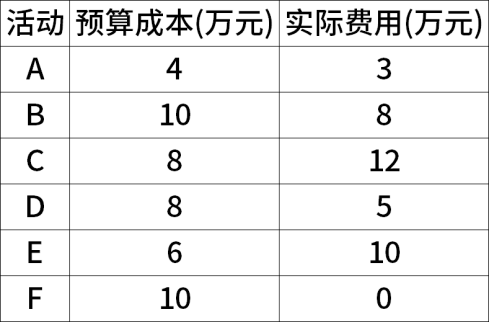
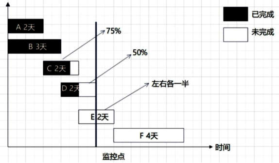
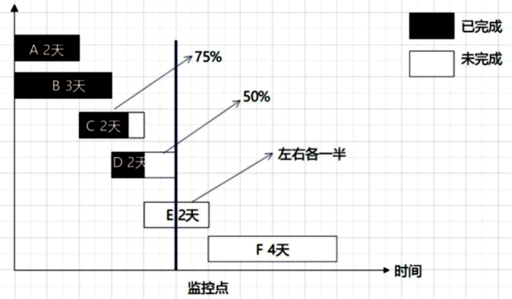
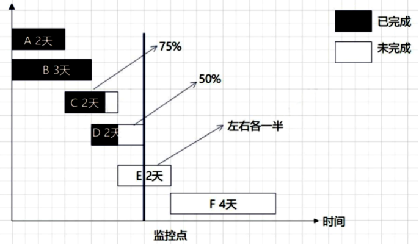
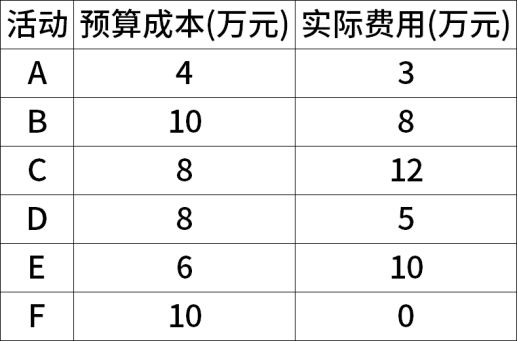
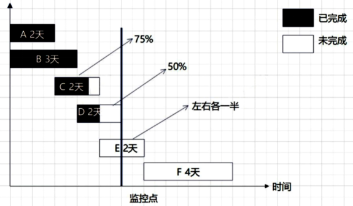

# 软考高项综合测试题-案例（1）

- 试卷 tid：`2416`
- 作答记录 tid：`6952892`
- 来源：https://yun.aura.cn/Test/alsTyper/lid/0/tid/6952892/typer/5/write/3.html

## 试题一

【说明】
B公司中标工期为12个月的某客户A的森林防火视频监测预警系统，项目开始后，B公司任命小李担任该项目的项目经理，由于工期紧任务重小李在项目启动阶段确定了项目团队的成员并制订了项目整体进度计划后立即开展了工作。为保证项目质量，小李口头授权有着多年的工作经历的张工兼任项目的质量保证人员。要求张工在项目的重要阶段必须重点进行质量检查。在检查时，张工可以根据自己的经验提出要求，对于不满足要求的工作，必须立即进行返工。项目需要采购一批摄像头，考虑到项目成本，项目经理小李直接选择了经常合作的供应商C并与其口头商定了相关采购事宜，合同约定交货周期为2个月，供应商C提出预付全部货款才能按时交货，小李同意了对方的要求。临近交货日期，C公司提出，因为最近公司订单太多，无法按时支付全部货物，经过几次催促，C公司才答应交付80%的货物，且产品进入现场后，客户A反馈摄像头有大量残次品，小李与C公司交涉多次，相关问题都没有得到解决，客户A很不满意。并且在某次项目例会时，客户A发现B公司未经同意将项目的某项重要工作分包给了另一家公司，通过查阅商务合同，以及B公司投标文件发现，B公司未在这两份文件中提及任何分包事宜。

【问题1】（10分）
结合案例，请从采购管理和质量管理角度，指出存在的问题。

【问题2】（6分）
分包需要具备哪些条件，本项目中有哪些违反了哪些规定。

【问题3】（5分）
请写出合同应包含的主要内容。

【问题4】（4分）
质量管理员检查产品，有质量问题，请问这个属于质量管理的哪个过程，请指出这个过程的两个主要作用。

### 参考答案

【问题1】（10分）
（1）只制订了整体进度计划，没有制订质量管理计划和采购管理计划。（2）缺乏相应的质量标准。（3）质量保证人员的选择不符合项目要求。（4）对质量保证人员的授权不合理。（5）没有采取质量保证措施，导致大量的残次品。（6）不应只在项目的重要阶段进行质量检查（不要等产品完成后再检查） ，应加强项目过程中的质量控制或检查。（7）小李选择了经常合作的供应商并口头约定，未签订正式的采购合同。（8）未进行有效的采购控制，导致设备未按时交付。

【问题2】（6分）
订立项目分包合同必须同时满足5个条件：①经过买方认可；②分包的部分必须是项目非主体工作；③只能分包部分项目，而不能转包整个项目；④分包方必须具备相应的资质条件；⑤分包方不能再次分包。本项目中违反了：①经过买方认可；②分包的部分必须是项目非主体工作。

【问题3】（5分）
（1）项目名称。（2）标的内容和范围。（3）项目的质量要求。（4）项目的计划、进度、地点、地域和方式。（5）项目建设过程中的各种期限。（6）技术情报和资料的保密。（7）风险责任的承担。（8）技术成果的归属。（9）验收的标准和方法。（10）价款、报酬（或使用费）及其支付方式。（11）违约金或者损失赔偿的计算方法。（12）解决争议的方法。（13）名词术语解释。

【问题4】（4分）
属于控制质量过程。本过程的主要作用：①核实项目可交付成果和工作已经达到主要干系人的质量要求，可供最终验收；②确定项目输出是否达到预期目的，这些输出需要满足所有适用标准、要求、法规和规范。

---

## 试题二

【说明】
项目各活动的工期、预算成本及监控日的实际费用，如下表所示：

**题图：**

【问题1】（5分）
根据甘特图计算项目的关键路径，并计算项目的总工期。

【问题2】（5分）
项目实施过程中D工期延长1天，请问关键路径是否发生变化。

【问题3】（8分）
请判断监控点项目的绩效情况，并给出判断依据。

【问题4】（7分）
在监控点出现的这种偏差会持续下去，请预测项目的ETC。在此条件下，项目完工后预计超支多少钱？

### 参考答案

【问题1】（5分）
关键路径A-C-E-F。总工期为10天。

【问题2】（5分）
活动 D不在关键路径上，而且活动 D 即使延长1天，也不会影响总工期，但是会导致关键路径有两条，分别是A-C-E-F和B-D-F。

【问题3】（8分）
PV=A+B+C+D+E*50%=4+10+8+8+6*50%=33（万元）AC=3+8+12+5+10=38（万元）EV=A+B+C*75%+D*50%+E*0=4+10+8*75%+8*50%+0=24（万元）

【问题4】（7分）
依题意，这种偏差会持续，说明是典型偏差BAC=4+10+8+8+6+10=46（万元）CPI=EV/AC=24/38=0.63EAC=AC+ETC=AV+(BAC-EV)/CPI=BAC/CPI=46/（24/38）=72.83（万元）VAC=BAC-EAC=46-72.83=-26.8（万元）因此，项目完工后，预计超26.8万元。

---

## 试题三

【说明】
A公司中标某客户智慧化园区管理系统建设项目，该项目涉及园区中心机房基础设施建设、基础网络设备、信息安全建设、综合管理系统研发等方面工作。公司任命小张担任项目经理。小张从公司相应的技术部门分别抽调了相关技术人员，加入组成了项目部。由于公司没有中心机房基础设施建设相关经验，因此将本项目的中心机房基础设施工作外包给了B公司。小张认为，该项目工作内容复杂，涉及人员较多，人员沟通很关键，作为项目经理，自己应投入较大精力在人员沟通管理和干系人管理上。首先在项目的初期小张对干系人进行了识别，建立了干系人登记册，主要人员包括客户方的4名技术人员、3名中层管理人员、2名高管和项目团队人员，以及A公司的2名高管和B公司的3名技术人员、2名施工人员、1名管理人员。识别干系人后及时形成了权力利益方格。小张认为编制沟通管理计划是一件重复性的工作，于是自己参考过去的项目管理计划，简单进行了修改后放入了项目计划文件夹下作为公共信息供大家查阅，为了高效地进行沟通，沟通管理计划中规定每周五16:00采用谈话的形式召开每周工作例会，项目阶段性总结会通过电子邮件汇报即可。随着项目的进展，B公司由于施工人员变动，小张于是对干系人进行了重新识别。但在进行过程中A公司各技术部门的主管抱怨说，他们抽调了大量技术人员参与该项目，但无法掌控他们的工作安排，也不知道他们的工作绩效。而且小张发现B公司的工作进度也有所延迟，当问及B公司的相关负责人时，他们表示对此并不知情。另外，A公司高层领导也向小张表示，他们认为每天浪费了大量时间看了一些无用的信息，他们希望小张能当面汇报，小张汇报时并不清楚干系人当前及其未来的参与水平，导致客户管理层对该项目也有些不满。

【问题1】（10分）
结合案例，请指出小张在干系人管理与沟通管理方面存在的错误。

【问题2】（4分）
请写出管理干系人参与、监督干系人参与的定义与作用。

【问题3】（6分）
结合案例，请指出小张做了哪些工作是符合干系人管理的。

【问题4】（5分）
请写出促进干系人参与的步骤包括哪些。

### 参考答案

【问题1】（10分）
1.沟通管理：①　项目经理对沟通管理的认知存在问题，他认为编制沟通管理计划是一件重复性的工作。②　沟通管理计划不能只小张一人制订。③　沟通管理计划不应该作为公共信息供大家查阅，而是应该要求所有相关人员按计划执行。④　沟通控制工作做得不好，没有对存在的沟通问题及时进行解决。⑤　沟通管理计划中每周例会应该采取会议的形式进行沟通。⑥　沟通管理计划中项目阶段性总结会应该采取会议的形式进行沟通。⑦　未能及时与客户沟通，引起客户不满。⑧　未对沟通结果进行监控。2.干系人管理：①　不应该由小张一人对干系人进行识别并建立干系人登记册，应由项目经理组织相关干系人共同参与。②　小张没有针对不同的干系人选择不同的沟通渠道与项目信息。③　规划干系人过程中小张没有生成干系人参与度评估矩阵。④　未有效地管理干系人的参与。⑤　未有效的监督干系人参与。

【问题2】（4分）
1.管理干系人参与是通过与干系人进行沟通协作，以满足其需求与期望、处理问题，并促进干系人合理参与的过程。本过程的主要作用是，尽可能提高干系人的支持度，并降低干系人的抵制程度。2.监督干系人参与是监督项目干系人的关系，并通过修订参与策略和计划来引导干系人合理参与项目的过程。本过程的主要作用是，随着项目进展和环境变化，维持或提升干系人参与活动的效率和效果。

【问题3】（6分）
1.充分识别项目所有干系人，并将干系人进行分类。2.识别干系人后及时形成了权力利益方格。3.当B公司更换人员后重新识别了干系人。

【问题4】（5分）
促进干系人参与的步骤包括：识别、理解、分析、优先级排序、参与和监督。

---
