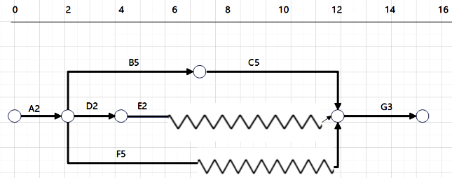
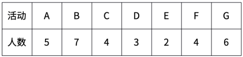

# 软考高项综合测试题-案例（2）

- 试卷 tid：`2417`
- 作答记录 tid：`7036270`
- 来源：https://yun.aura.cn/Test/alsTyper/lid/0/tid/7036270/typer/5/write/3.html

## 试题一

【说明】
某银行为提升管理水平，通过招投标选定A公司为其开发决策的智能化的系统。A公司组建了项目团队，任命小王担任项目经理。由于公司没有基础设施方面的技术能力，因此将本项目的基础设施建设工作外包给了B公司，B公司联系人为牛总。小王安排研发总监小杨制定沟通管理计划并识别干系人，小杨认为编制沟通管理计划是一件重复性的工作，于是参考过去的项目管理计划，简单进行了修改后放入了项目计划文件夹下作为公共信息供大家查阅。小杨经过识别干系人，主要人员包括客户方的1名技术人员小张、1名中层管理人员娄经理、2名高管刘总和向总。在项目实施过程中，项目成员严格按照要求，每天下班前发送日报给小王。第二天上午9点前，小王汇总所有成员的日报内容，发送给所有干系人。在此期间每次参加客户召集的项目沟通会，小王会根据项目组人员空闲时间临时安排参会人员。参会人员不固定，新的参会人员对之前会议需要确认的内容毫不知情，这种情况时有发生。引起客户强烈不满，沟通不好，效率也不高。随着项目的实施，项目进入第一次上线阶段，由于前期需求调研未征求向总意见，向总认为不符合自己的需求，拒绝签字，导致上线失败，希望小王能当面汇报情况。

【问题1】（8分）
结合案例，请从干系人管理与沟通管理的角度，指出存在的问题。

【问题2】（6分）
请写出干系人登记册主要包括的内容。

【问题3】（6分）
请写出用于规划干系人参与的项目管理计划组件包括哪些？

【问题4】（5分）
结合案例，判断下列说法的正误（填写在对应栏内，正确的填写“√”，错误的填写“×”）。 （1）在开展管理干系人参与过程时，应该根据沟通管理计划，针对每个干系人采取相应的沟通方法。（ ） （2）识别干系人应在项目初期开展且仅开展一次，尽可能识别所有干系人。（ ） （3）干系人参与计划主要包括调动干系人个人或群体参与的特定策略或方法。（ ） （4）适用于识别干系人过程的数据表现技术是干系人映射分析和表现。（ ） （5）观察和交谈有助于项目经理和团队通过考虑文化差异和干系人需求，来实现有效沟通。（ ）

### 参考答案

【问题1】（8分）
一、沟通管理过程存在的问题：（1）项目经理对规划沟通管理工作重视程度不够。（2）不应该由负责研发的小杨制定沟通管理计划，工作安排不合理，用人不当。（3）小杨对沟通管理计划的认知存在问题，制定沟通管理计划未结合项目实际情况，只参考了以往的计划，进行简单修改。（4）制定沟通管理计划后没有经过评审。（5）沟通管理计划不应该作为公共信息供大家查阅，而是应该要求所有相关人员按计划执行。（6）项目沟通会不应该由客户召集。（7）每次开会，不应该临时安排参会人员，应提前通知安排。（8）召开会议前，应提前准备会议议题。 （9）未能及时与客户沟通，引起客户不满。二、干系人管理存在的问题：（1）不应该由负责研发的小杨识别干系人，工作安排不合理，用人不当。（2）没有针对不同的干系人选择不同的沟通渠道与项目信息。（3）干系人登记册中忽视了B公司的相关人员。

【问题2】（6分）
干系人登记册是识别干系人过程的主要输出，记录已识别干系人的信息，主要包括： ①身份信息：姓名、组织职位、地点、联系方式，以及在项目中扮演的角色。②评估信息：主要需求、期望、影响项目成果的潜力，以及干系人最能影响或冲击的项目生命周期阶段。 ③干系人分类：用内部或外部，作用、影响、权力或利益，上级、下级、外围或横向，或者项目经理选择的其他分类模型进行分类的结果等。

【问题3】（6分）
可用于规划干系人参与的项目管理计划组件主要包括：①资源管理计划 ②沟通管理计划 ③风险管理计划。

【问题4】（5分）
（1）在开展管理干系人参与过程时，应该根据沟通管理计划，针对每个干系人采取相应的沟通方法。（√ ） （2）识别干系人应在项目初期开展且仅开展一次，尽可能识别所有干系人。（× ） 解析：识别干系人应根据需要在整个项目期间定期开展，尽可能识别所有干系人。（3）干系人参与计划主要包括调动干系人个人或群体参与的特定策略或方法。（√ ） （4）适用于识别干系人过程的数据表现技术是干系人映射分析和表现。（ √） （5）观察和交谈有助于项目经理和团队通过考虑文化差异和干系人需求，来实现有效沟通。（ ×）解析：文化意识有助于项目经理和团队通过考虑文化差异和干系人需求，来实现有效沟通。

---

## 试题二

【说明】
下图描述了某项目的进度信息，字符代表活动名称，数字代表完成该活动的工期。已知活动的预算成本为工期*人数*1万元/人天，第12天时，项目已花费成本80万元，此时A、B、D、E均已完工，C、F各完成75%，G尚未开始。

**题图：**

【问题1】（6分）
该网络图为（ ）图，项目的工期为（ ）天，关键路径是（ ）。

【问题2】（4分）
如果参与项目的工程师均为全能手，可以完成任意一项活动，该项目至少需要多少人，并给出调整方案。

【问题3】（5分）
请计算项目的BAC

【问题4】（5分）
计算项目12天时的绩效情况。

【问题5】（5分）
针对项目现在的情况，项目经理应该采取哪些措施。

### 参考答案

【问题1】（6分）
时标网络图；总工期15天；关键路径为：A-B-C-G。

【问题2】（4分）
至少需要10人，活动F推迟5天开始。

【问题3】（5分）
BAC=2*5+5*7+5*4+2*3+2*2+5*4+3*6=113（万元）已知活动的预算成本为工期*人数*1万元/人天，第12天时，项目已花费成本80万元，此时A、B、D、E均已完工，C、F各完成75%，G尚未开始。

【问题4】（5分）
PV=A+B+C+D+E+F=2*5+5*7+5*4+2*3+2*2+5*4=95（万元）EV=A+B+D+E+ (C+F)*75%=2*5+5*7+2*3+2*2+（5*4+5*4）*75%=85（万元）AC=80（万元）CV=EV-AC=85-80=5>0，所以成本节约。SV=EV-PV=85-95=-10<0，所以进度滞后。已知活动的预算成本为工期*人数*1万元/人天，第12天时，项目已花费成本80万元，此时A、B、D、E均已完工，C、F各完成75%，G尚未开始。

【问题5】（5分）
（1）赶工，投入更多的资源或增加工作时间，以缩短关键活动的工期（2）快速跟进，并行施工，以缩短关键路径的长度。（3）使用高素质的资源或经验更丰富的人员。（4）减小活动范围或降低活动要求。（5）改进方法或技术，以提高生产率。（6）加强质量管理，及时发现问题，减少返工，从而缩短工期。

---

## 试题三

【说明】
A公司承接了某大型国企的一个信息化开发项目。项目建设内容包括软件的开发、视频终端的采购等，A公司领导指定小王为该项目的项目经理。项目启动后，小王考虑到公司无法生产视频终端，报公司领导和该国企审批后决定对外采购。并列出了潜在的供应商，形成了项目采购管理计划。考虑到公开招标可以在更广的范围内选择供应商，于是项目组决定采购合同，考虑到该国企的设备需求存在变数，因此在合同中约定双方将按项目工作的实际调试工时数和设备数量，按事先确定的单位工时费用标准和单位设备费用标准进行结算。项目实施到三个月时，需要视频终端设备进场，小王和C公司确认设备的到货时间，结果得到的答复是：可以按时进场，但所订购的视频终端型号已停产，只能用另一种型号设备代替，并表示两种型号性能差不多。小王考虑项目工期较为紧张，同意了此变更。在系统调试的过程中，项目组发现视频终端与系统连接经常掉线，发现是接口不一致所导致，需要重新开发接口程序。小王要求C公司承担接口开发费用，但C公司答复说更换设备是经小王同意，双方僵持不下。小王查阅合同内容，并未发现相应的违约条款。

【问题1】（10分）
结合案例，说明本项目在采购管理中开展了哪些活动，分别属于哪个采购过程。

【问题2】（8分）
结合案例，说明本项目采购管理过程中还需增加哪些措施。

【问题3】（5分）
结合案例，说明本项目A公司与视频终端供应商应采用哪种合同？为什么？

### 参考答案

【问题1】（10分）
本项目在采购管理中开展了如下活动：（1）对视频终端采购进行了规划；（2）选择潜在买家；（3）对视频终端采购进行了公开招标；（4）与中标供应商签订了采购合同；（5）对供应商供货情况进行了跟踪；（6）对合同进行了变更。上述活动归属过程如下：（1）对视频终端采购进行了规划属于规划采购管理过程；（2）选择潜在买家属于规划采购过程；（3）对视频终端采购进行公开招标属于实施采购过程；（4）与中标供应商签订合同属于实施采购过程；（5）对供应商供货情况进行跟踪属于控制采购过程；（6）对合同进行变更属于控制采购过程。

【问题2】（8分）
本项目采购管理过程中还需增加下列措施：（1）应在规划采购过程中明确供应商选择标准；（2）在规划采购过程中明确采购方法；（3）应在签订合同前与供应商进行合同谈判，明确合同相关内容；（4）拟定合同变更流程，按合同变更流程处理合同变更，且应有书面文件。（5）加强控制采购工作，监督合同绩效。

【问题3】（5分）
本项目应采用工料合同。因为工作性质清楚，但范围不是很清楚，而且工作不复杂，又需要快速签订合同，则使用工料合同。

---
