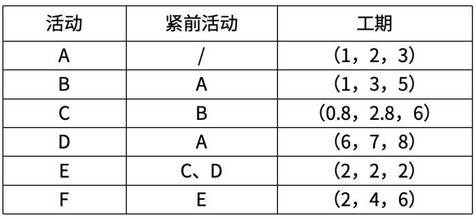
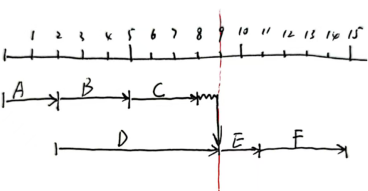

# 软考高项综合测试题-案例（3）

- 试卷 tid：`2418`
- 作答记录 tid：`7036280`
- 来源：https://yun.aura.cn/Test/alsTyper/lid/0/tid/7036280/typer/5/write/3.html

## 试题一

【说明】
某银行因业务发展需求，需上马一套信息管理系统及配套设备，并对项目建设进行了公开招标，在招标文件中详细说明了开发需求和所需设备型号及数量。经过激烈角逐，A公司顺利中标，双方就该项目建设及配备设备购置签订了合同。随后A公司任命小张担任项目经理。项目启动初期，小张任命项目成员小李担任项目的质量管理员，专职负责质量管理，考虑到小李是团队中最资深的工程师，有丰富的实践经验，小张给予小李充分授权，让他全权负责项目的质量管理。得到授权后，小李制订了质量管理计划，内容包括每月进行质量抽查、每月进行质量指标分析、每半年进行一次内部审核等工作。2022年7月份，在向客户进行半年度工作汇报时，客户表示对项目的不满，一是项目进度比预期滞后；二是项目的阶段交付物不能满足合同中的质量要求。由于质量管理工作由小李全权负责，小张并不清楚究竟出现了什么问题，因此，他找小李进行了沟通，得到两点反馈：（1）在每月进行质量检查时，小李总能发现一些不符合项。每次都口头通知了当事人，但当事人并没有当回事，同样的错误不断重复出现。（2）小李认为质量管理工作太得罪人，自己不想继续负责这项工作。接着，小张与项目组其他成员也进行了沟通，也得到两点反馈：（1）小李月度检查工作的颗粒度不一致。针对他熟悉的领域，会检查得很仔细，针对不熟悉的领域，则一带而过。（2）项目组成员普遍认为：在项目的重要里程碑节点进行检查即可，没必要每月进行检查。

【问题1】（6分）
请填写（1）～（3）处的答案。项目合同按范围分，分为单项承包合同、（1）和（2）；按合同范围分，本项目采用的是（3）。

【问题2】（6分）
把正确选项填入相应的答题区。结合案例，本项目适用（ ）合同。A.固定总价合同                          B.总价加激励费用合同C.总价加经济价格调整合同    D.成本补偿合同

【问题3】（12分）
结合案例，请指出张经理和小李在项目质量管理过程分别做了哪些工作，请指出需要改进之处。

【问题4】（4分）
请填写（1）～（2）处的答案。供方选择方法包括：最低成本、（1 ）、基于质量或技术方案得分、基于质量和成本、（2 ）、固定预算法。

### 参考答案

【问题1】（6分）
（1） 总承包合同；（2）分包合同；（3）总承包合同。

【问题2】（6分）
A

【问题3】（12分）
小张和小李在质量管理中做了如下工作：（1）小张任命了小李为质量管理员，让他全权负责项目的质量管理。（2）小李制订了质量管理计划。（3）小李每月开展质量检查。（4）小李把检查发现的不符合项口头通知了当事人。小张和小李在质量管理中需要改进之处：（1）小张任命小李为质量管理员，让他全权负责项目的质量管理后，不能放任不管，需要对质量管理工作进行指导、监控。（2）小李不能个人单独制订质量管理计划，需要干系人共同参与。（3）小李制订的质量管理计划内容不全，计划中应明确相关的质量标准，且要经评审。（4）小李每月开展质量检查颗粒度要一致。（5）小李发现质量问题后应及时记录和书面通知相关人员进行整改，并跟踪整改情况。（6）小李应对项目团队成员开展质量培训。

【问题4】（4分）
（1）仅凭资质；（2）唯一来源。

---

## 试题二

【说明】
某项目活动信息如下表所示：项目预算按天核定，任一活动一天的成本为2万元。项目实施到第9天时，项目总花费为32万，此时各活动完成情况为：A、B、C、D均已完工，E已完成一半，F尚未开工。

**题图：**

【问题1】（9分）
计算项目各活动工期，关键路径，总工期。

【问题2】（6分）
（1）如果活动C拖延1天，项目的总工期是否发生变化？关键路径如何变化？（2）如果活动C拖延2天，项目的总工期是否发生变化？关键路径如何变化？

【问题3】（7分）
请判断项目第9天结束时项目的绩效情况。

【问题4】（3分）
项目产生的偏差是一种临时性的偏差，请预测项目的完工成本EAC。

### 参考答案

【问题1】（9分）
根据三点估算，各活动工期如下：活动A的工期=(1+2*4+3) /6=2天活动B的工期=(1+3*4+5) /6=3天活动C的工期=(0.8+2.8*4+6) /6=3天活动D的工期=(6+7*4+8)/6=7天活动E的工期=(2+2*4+2) /6=2天活动F的工期=(2+4*4+6)/6=4天该项目的关键路径是A-D-E-F，总工期是15天。

【问题2】（6分）
如果活动C拖延1天，项目的总工期不会发生变化，因为活动C在非关键路径上，总浮动时间为1天，可允许拖延1天，不影响总工期。如果活动C拖延2天，项目的总工期会发生变化，因为活动 C的总浮动时间只有1天，如果拖延2天，总工期会延误1天。

【问题3】（7分）
依题意：AC=32（万元）PV=PV(A)+PV(B)++PV(C)+PV(D)=2*2+3*2+3*2+7*2=30(万元)EV=PV(A)+PV(B)+PV(C)+PV(D)+PV(E)*1/2=32(万元)CV=EV-AC=32-32=0，所以成本持平；SV=EV-PV=32-30=2>0，所以进度超前。项目预算按天核定，任一活动一天的成本为2万元。项目实施到第9天时，项目总花费为32万，此时各活动完成情况为：A、B、C、D均已完工，E已完成一半，F尚未开工。

【问题4】（3分）
依题意，项目产生的是临时性的偏差，是非典型偏差，所以BAC=2*(2+3+3+7+2+4)=42(万元)EAC=AC+ETC=AC+(BAC-EV)=32+42-32=42(万元)

---

## 试题三

【说明】
某社区中心需要开发和部署一个老年人信息系统服务项目和建设一个网站，A公司为该项目的承建商。信息系统服务项目中包括多个模块，其中“出游服务”模块明确了提供交通服务、集体出游和活动、看护者关怀等详细需求；“老年人服务”模块要求先完成“上门送餐服务”，随后可提供看护者关怀、成人日间护理等服务，每项服务都将单独实施，并可在各自完成时进行部署，每项服务都会增加和改善面向社区的老年人服务；“培训方案”模块由基础培训、后勤培训和巡查培训子模块构成，社区中心要求各子模块可以同时进行的方式，也可以先开发一个模块、收集反馈，然后再开发后续模块，但只有在所有模块均开发完毕并且进行了集成与部署后，“培训方案”模块才可用。社区网站的建设则要求预先定义高层级需求、设计页面布局，并在网站上部署一组初始信息，用户和内部干系人将提供待办事项列表的内容。项目团队对待办事项列表进行优先级排序，开发并部署新内容。随着新需求和新范围的出现，团队会对该工作进行估算，并完成工作；一旦经过测试，就向社区中心展示该工作成果，如果获得批准，工作成果将部署到网站上。另外“人员信息管理模块”要求定期交付。社区中心还要求软件程序分解为相互连接的服务，这些服务可从互联网上的一系列供应商处获得，而应用程序则是这些服务链接在一起形成的组合。

【问题1】（5分）
结合案例，指出什么是交付节奏，项目交付节奏有哪些。

【问题2】（7分）
请指出项目开发方法和生命周期绩效域的预期目标和绩效要点。

【问题3】（3分）
请指出本项目适合采用哪种架构模式。

【问题4】（10分）
结合案例，请填写（1）～（5）处的正确选项。社区网站适用（1）开发方法；培训方案模块适用（2）开发方法；老年人服务模块适用（3）开发方法；出游服务模块适用（4）开发方法；人员管理模块适用（5）开发方法。A. 预测   B.迭代  C.增量  D.自适应

### 参考答案

【问题1】（5分）
交付节奏是指项目可交付物的时间安排和频率。项目的交付节奏包括：（1）一次性交付；（2）多次交付；（3）定期交付；（4）持续交付。

【问题2】（7分）
项目开发方法和生命周期绩效域的预期目标如下：（1）开发方法与项目可交付物相符合；（2）将项目交付与干系人价值紧密关联；（3）项目生命周期由促进交付节奏的项目阶段和产生项目交付物所需的开发方法组成。项目开发方法和生命周期绩效域的绩效要点如下：（1）交付节奏；（2）开发方法；（3）开发方法的选择；（4）协调交付节奏和开发方法及生命周期

【问题3】（3分）
面向服务的架构。

【问题4】（10分）
社区网站适用（D）开发方法；培训方案模块适用（C）开发方法；老年人服务模块适用（B）开发方法；出游服务模块适用（A）开发方法；人员管理模块适用（D）开发方法。A.预测   B.迭代  C.增量  D.自适应

---
