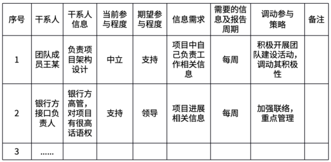
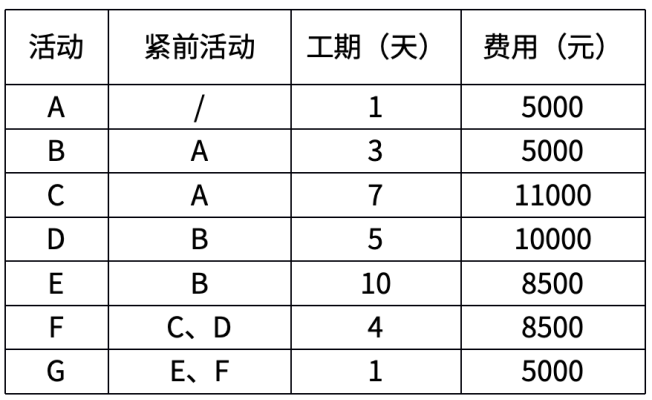
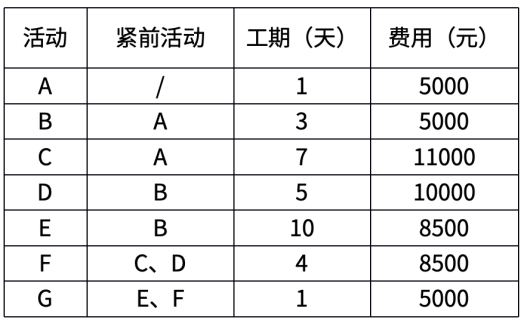
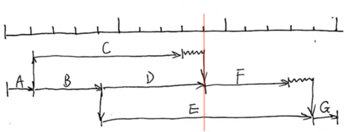
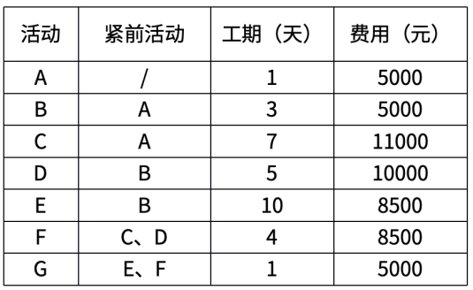
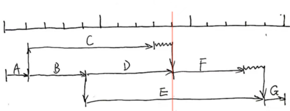
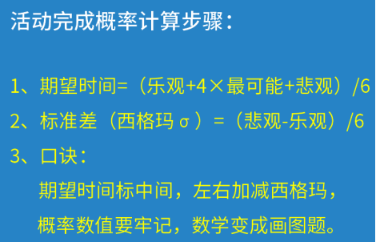
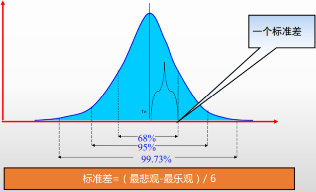

# 软考高项综合测试题-案例（4）

- 试卷 tid：`2419`
- 作答记录 tid：`7036283`
- 来源：https://yun.aura.cn/Test/alsTyper/lid/0/tid/7036283/typer/5/write/3.html

## 试题一

【说明】
某银行拟建设数据中心，该项目涉及数据中心基础设施、网络、硬件、软件、信息安全建设等方面工作。A公司作为该项目承建商，任命了张伟担任该项目的项目经理。张伟从相应的技术服务部门（网络服务部、硬件服务部、软件服务部、信息安全服务部）分别抽调了技术人员加入该项目。这些技术人员大部分时间投入本项目，小部分时间参与公司的其他项目。由于公司没有基础设施方面的技术能力，因此将本项目的基础设 施建设工作外包给了B公司。张伟认为，该项目工作内容复杂，涉及人员较多，干系人管理很关键，作为项目经理，自己应投入较大精力在管理干系人参与上。首先，张伟经过分析，建立了干系人名册，主要人员包括客户方的4名技术人员、3名中层管理人员、2名高管和项目团队人员以及A公司的2名高管。项目实施过程中，张伟发现B公司的技术人员的工作质量经常不能满足要求，工作进度也有所延迟，当问及B公司的相关负责人时，他们表示对此并不知情。A公司各技术服务部门的负责人还向张伟抱怨说，他们抽调了大量技术人员参与该项目，但却无法掌控他们的工作安排，也不知道他们的工作绩效；部分团队成员对项目工作表达了不满，认为这个项目占用了他们太多时间，绩效考评结果却偏低。项目进行到第3个月时，由于银行方内部机构改革，银行方的项目接口负责人和对接部门发生变化，但张伟在向新的接口人对接的同时，也把项目相关情况汇报给原接口负责人，导致对方很不满意。

**题图：**

【问题1】（10分）
请指出项目干系人管理方面存在哪些问题。

【问题2】（6分）
结合案例，编制一份干系人参与计划。

【问题3】（5分）
结合案例，请将下面（1）～（5）处的正确选项填写在答题区的对应栏内。管理干系人参与过程的工具与技术包括（1）、（2）（3）（4）和（5）。A.专家判断        B.沟通技能        C.干系人参与度评估矩阵 D.人际关系与团队技能       E.决策       F.基本规则       G.会议       H.数据收集技术       I.数据表现技术

【问题4】（4分）
结合案例，指出干系人绩效域的预期目标。

### 参考答案

【问题1】（10分）
管理干系人参与存在以下问题：（1）张伟个人识别干系人不妥，应与团队成员、相关专家一起进行。（2）干系人识别不全面，如缺少B公司人员。（3）干系人识别未反复进行。（4）未编制干系人参与计划。（5）管理干系人参与存在问题，未及时处理干系人关注点，导致干系人不满。（6）未能有效调动干系人参与项目。（7）监督干系人参与存在问题，干系人发生变化后，未及时更新管理干系人参与策略。

【问题2】（6分）
本项目干系人参与计划如下：

【问题3】（5分）
（1）A   （2）B  （3）D  （4）F  （5）G （顺序可变）

【问题4】（4分）
干系人绩效域的预期目标主要包含：（1）与干系人建立高效的工作关系；（2）干系人认同项目目标；（3）支持项目的干系人提高了满意度，并从中收益；（4）反对项目的干系人没有对项目产生负面影响。

---

## 试题二

【说明】
某项目活动信息如下表所示：

**题图：**

【问题1】（10分）
计算项目关键路径，总工期和BAC。

【问题2】（7分）
第9天结束时，活动A、B、C均已完工，活动D完成了90%，活动E完成了60%，活动F和G尚未开始。项目实际花费了31500元。请计算项目的AC、EV、PV、CV、SV，并判断项目绩效情况。

【问题3】（3分）
如果项目偏差10%以内认为是正常的，请判断该项目是否需要纠偏？

【问题4】（5分）
假如该项目遇到技术困难，最悲观完工时间预计为20天；如项目进展顺利，则最快可在8天内完工；综合各种情况，最可能完成时间为14天，请计算该项目16天后完工的概率。

### 参考答案

【问题1】（10分）
项目的关键路径为A-B-E-G 总工期为15天；BAC=5000+5000+11000+10000+8500+8500+5000=53000元。

【问题2】（7分）
AC=31500(元)PV=PV(A)+PV(B)+PV(C)+PV(D)+PV(E)*50%=5000+5000+11000+10000+8500*50%=35250(元)EV=PV(A)+PV(B)+PV(C)+PV(D)*90%+PV(E)*60%=5000+5000+11000+10000*90%+8500*60%=35100(元)CV=EV-AC=35100-31500=3600>0，所以成本节约 SV=EV-PV=35100-35250=-150<0，所以进度滞后

【问题3】（3分）
CPI=EV/AC=35100/31500=111.43%SPI=EV/PV=35100/35250=99.57%因为CPI偏差大于了10%，所以需要纠偏。

【问题4】（5分）
根据三点估算法，期望工期=（乐观时间+4×最可能时间+悲观时间）/6，该项目的期望工期=（8+14*4+20）/6=84/6=14天；标准差=（20-8）/6=2；16-14=2，所以16天的时间区间为一个正的标准差；16天后的完成概率=100%-50%-（68.26%/2）=15.87%

---

## 试题三

【说明】
某物流公司因业务需要，拟建设一套智慧物流平台信息系统，并对项目建设进行了公开招标，A公司长期从事系统集成项目，但并不具备智慧物流平台信息系统的开发经验。在参与此项目的招投标时，虽然认为项目风险较大，但为了企业的业务发展，还是觉得应该投标，并最终中标。张工被任命为该项目的项目经理。项目之初，根据合同中的相关条款，张工在计划阶段简单地描绘了项目的大致范围，列出了项目应当完成的工作，然后发布了项目章程。考虑到该公司对此类项目尚无成熟案例，他认为做好项目风险管理很重要，就参照以前的项目模板，编制了一个项目风险管理计划，经公司领导签字后就下发各小组实施。但随着项目的进行，各成员发现项目中面临的问题与风险管理计划缺乏相关性，就按照各自理解对实际风险采取应对措施，导致项目绩效较差；同时在项目进展过程中，物流公司各部门经常性地提出一些小需求，本着让客户满意的原则，张工都安排团队成员一一进行了满足，到项目后期，张工发现系统功能实现与初期的项目需求相去甚远，未能按期交付系统，项目款项也迟迟不能收回。

【问题1】（12分）
请指出张工在该项目整合管理和风险管理方面存在哪些问题？

【问题2】（5分）
结合案例，说明整体风险应对策略有哪些？

【问题3】（3分）
结合案例，请指出适用于实施定量风险分析过程的数据分析技术有哪些。

【问题4】（5分）
简述整合管理的目标。

### 参考答案

【问题1】（12分）
1.整合管理方面存在问题如下：（1）项目章程由张工发布不妥，应由公司高层或发起人发布。（2）未制订项目管理计划，以指导、监控项目工作。（3）变更未走变更流程。（4）未对项目工作进行有效监控，导致未能按期交付系统，项目款项迟迟不能收回。2. 风险管理方面存在以下问题：（1）在没有成熟案例的情况下，参照以前模板编制的风险计划不妥，偏离项目实际情况。（2）风险管理计划应该全员参与编制，必要时邀请相关专家以及干系人参与。（3）没有进行风险识别，并导致实际出现的问题与风险管理计划没有相关性。（4）没有对风险进行定性和定量分析。（5）未制订风险应对计划，按照各自理解对实际风险采取应对措施。（6）管理过程中缺乏对风险的监督和控制。

【问题2】（5分）
整体风险应对策略包括：（1）规避。（2）开拓。（3）转移或分享。（4）减轻或提高。（5）接受。

【问题3】（3分）
适用于实施定量风险分析过程的数据分析技术主要包括：（1）模拟。（2）敏感性分析。（3）决策树分析。（4）影响图。

【问题4】（5分）
项目整合管理的目标包括：（1）资源分配；（2）平衡竞争性需求；（3）研究各种备选方法；（4）裁剪过程以实现项目目标；（5）管理各个项目管理知识领域之间的依赖关系。

---
