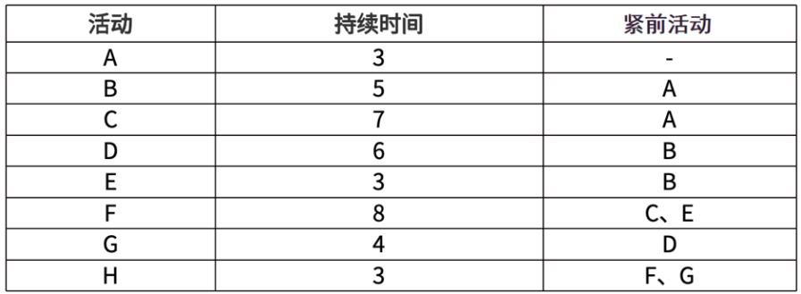
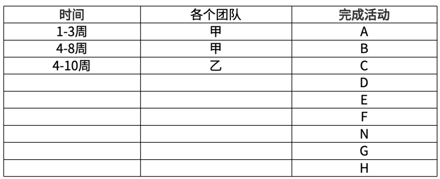
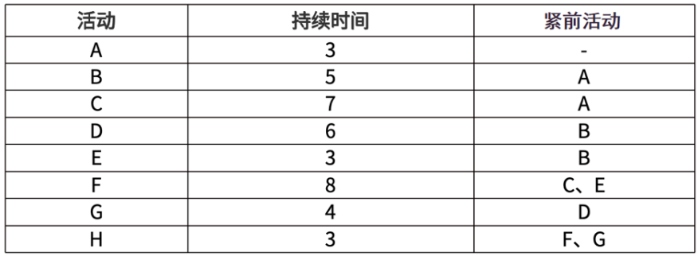
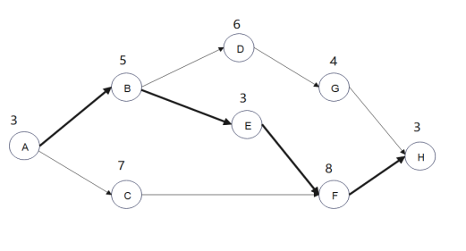
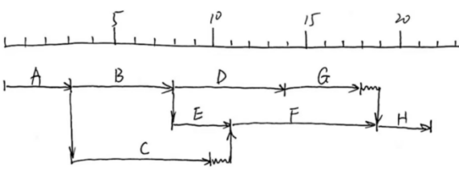
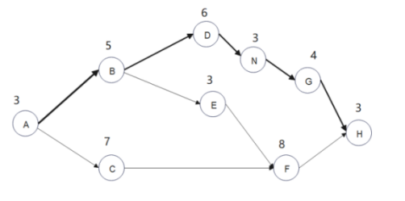
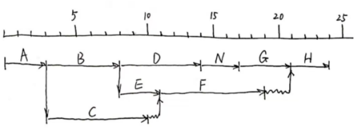
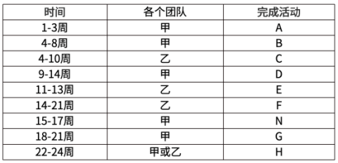
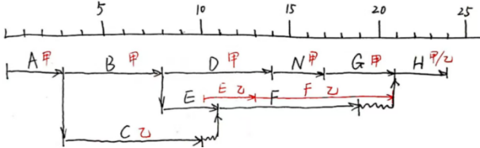

# 软考高项综合测试题-案例（5）

- 试卷 tid：`2420`
- 作答记录 tid：`7036290`
- 来源：https://yun.aura.cn/Test/alsTyper/lid/0/tid/7036290/typer/5/write/3.html

## 试题一

【说明】
某金融机构信息化建设项目共100多个，质量管理部门仅有5名质量工程师。为提升交付质量，质量管理部决定引入外部力量协助开展质量管理工作，组建多层级质量管理体系，并委派部门具有丰富质量管理经验的张工负责此项工作。考虑到组织信息化项目的体量，张工通过招标方式引入了第三方QA团队共计20人，负责项目级QA工作，并根据项目重要程度，为每个项目配备QA人员负责项目的质量。质量管理部5名质量工程师担任组织级QA，对项目级QA进行监督检查，期望以此来保证项目级QA工作的客观性和有效性。张工建立了标准的质量检查单，要求各项目QA根据标准的检查单制定项目级的质量保证工作计划及检查单，并按照计划和检查单执行质量管理工作，同时要求组织级QA对项目级QA进行检查。新的质量制度执行3个月后，项目经理纷纷向张工反馈：项目具有各方面特殊性，项目质量检查单并不完全适用，有些检查项在项目工作中并不涉及，而上级审计机构及客户要求的部分特定交付成果却不在检查单中，难以起到质量审计作用。同时，组织管理层要求质量管理部出具工作阶段报告，张工发现当前并没有明确的度量指标能够对各项目团队质量情况进行评价，对各项目级QA的工作也无法客观评价。组织级QA向张工反馈：项目级QA工作不积极，不主动向组织级QA提交工作报告，由于项目数量较多，难以检查到项目级QA的每个工作细节，组织级QA只能根据经验随机挑选一部分认为重要的环节进行检查，检查结果并不客观。

【问题1】（12分）
结合案例，请从质量管理和沟通管理角度，指出存在的问题。

【问题2】（4分）
项目质量管理包括（1）、（2）（3） 三个主要过程。依据质量数据采集、数据分析和数据表现出具质量报告属于（4） 过程的工作。

【问题3】（3分）
结合案例，请填写合适的沟通方法（1）质量管理部向高级管理层电子邮件汇报质量工作情况属于（1）； （2）组织级QA从项目管理平台获取项目质量管理工作信息属于（2）； （3）项目级QA与组织级QA之间的沟通方法适合采用（3） ；

【问题4】（6分）
为了改善当前沟通问题，张工制定了项目级QA和组织级QA的沟通计划，计划中明确了汇报步骤和上报方式（ 电子邮件或会议）、上报频率。请帮张工补充沟通管理计划中缺少的内容。

### 参考答案

【问题1】（12分）
1.质量管理方面存在的问题：（1）张工没有组织制定质量管理计划。（2）没有结合项目实际情况制定的质量核对单，导致不适用。（3）没有制定团队质量度量指标，导致无法对各项目团队质量情况作出评价。（4）张工没有对各级QA进行质量管理培训指导，导致工作进展不顺。（5）张工未对组织级QA和项目级QA工作进行指导和监督。（6）管理质量的手段太过单一，只用了质量检查单，应结合多种方法进行。（7）没有建立系统的质量检查方法，导致QA只能根据经验随机挑选一部分认为重要的环节进行检查。2. 沟通管理方面存在的问题：（1）没有组织制定沟通管理计划。（2）未进行有效的管理沟通，没有向组织管理层提交阶段性报告，未满足干系人的信息需求。（3）没有建立有效沟通机制，项目级QA不主动向组织级QA提交工作报告。（4）沟通方法不正确，对于数量多的工作，没有采取合适的沟通方式，仅靠组织级QA自己检查。（5）未进行有效的监督沟通，直到第3个月时才收到项目经理反馈和发现问题。

【问题2】（4分）
（1）规划质量管理；（2）管理质量；（3）控制质量；（4）管理质量。

【问题3】（3分）
（ 每空1分）结合案例，请填写合适的沟通方法（1）质量管理部向高级管理层电子邮件汇报质量工作情况属于（推式沟通）； （2）组织级QA从项目管理平台获取项目质量管理工作信息属于（拉式沟通）； （3）项目级QA与组织级QA之间的沟通方法适合采用（互动沟通） ；

【问题4】（6分）
补充沟通管理计划中缺少的内容如下：①干系人的沟通需求；②需沟通的信息，包括语言、形式、内容和详细程度；③上报步骤；                  ④发布信息的原因；⑤发布所需信息、确认已收到或作出回应（若适用）的时限和频率；⑥负责沟通相关信息的人员； ⑦负责授权保密信息发布的人员；⑧接收信息的人员或群体，包括他们的需要、需求和期望；⑨用于传递信息的方法或技术，如备忘录、电子邮件、新闻稿，或社交媒体；⑩为沟通活动分配的资源，包括时间和预算；⑪随着项目进展而更新与优化沟通管理计划的方法；⑫通用术语表；⑬项目信息流向图、工作流程（可能包含审批程序）、报告清单和会议计划等；⑭来自法律法规、技术、组织政策等的制约因素等。

---

## 试题二

【说明】
某信息系统项目包含以下8个活动，各活动预计持续时间、成本估算和资源消耗如下表所示：

**题图：**

【问题1】（4分）
写出项目的关键路径，并计算项目的总工期。紧前活动

【问题2】（6分）
假设对项目原计划进行修改，新计划需要在活动D与活动G之间增加一个活动N，即活动N的紧前活动为D，活动G的紧前活动为N，活动N的持续为3周。请写出新计划下项目的关键路径，并计算新计划下的总工期。

【问题3】（15分）
假设安排两个团队共同完成项目，每个团队都能够独立完成任意活动，一项活动只能由一个团队完成，每个团队同一时间只能执行一项活动，并且某项活动开始后，团队必须持续到该活动结束后才能执行其他活动。请问项目是否能按照新计划按时完工？请继续完成下表的填写。

### 参考答案

【问题1】（4分）
关键路径为：A-B-E-F-H，总工期为：22周。（不用画图）

【问题2】（6分）
新计划下项目的关键路径为A-B-D-N-G-H；新计划下的项目总工期为24周。（不用画图）

【问题3】（15分）
可以按照新计划按时完工。各活动安排时间如下表。

---

## 试题三

【说明】
某市生态环境部门为提升环境综合治理能力，持续改善空气质量，决定建设智慧环境综合治理信息化平台。该平台包含二十个子系统，包括各方面数据监测采集系统、数据传输平台、数据综合分析平台、环境执法平台和决策支持系统等。A公司作为总集成单位中标了该项目，委派拥有多年环保信息化工作经验的张经理担任项目经理，负责项目的统筹管理工作。智慧环境综合治理平台中的油烟监测子系统包含监测设备和管理软件，实现辖区内餐饮企业的油烟排放数据监测和管理。生态环境部门向张经理推荐了与该部门有过合作经历的S公司作为油烟监测设备提供商，张经理调研了S公司的相关案例后，与S公司签订了设备采购合同。综合治理平台建设基本完成后投入试运行，环境执法部门提出油烟监测系统中数据误报，监测数据的精确度也未能达到执法管理要求，要求A公司予以解决。同时，根据上级环境监测机构要求，要求张经理提高系统中油烟监测的频率，并增加基于监测数据的分析和报警功能。张经理考虑后认为工作量不大，便联系S公司修改设备监测频率，同时通知本公司软件研发团队开发新功能。不久，S公司回复其提供的监测设备不支持批量修改监测频率，只能逐个更换控制单元，工作量大且更换成本高，A公司和S公司发生了纠纷，均不愿承担变更引发的成本。同时，张经理发现软件研发团队对于新功能研发的工作量也远超预期，而且由于增加了新功能还引发了新的缺陷，项目面临成本超支的风险。

【问题1】（10分）
结合案例，请指出张经理在采购管理和变更管理方面存在的不足。

【问题2】（6分）
请写出执行变更管理的工作程序。

【问题3】（4分）
请写出成本控制的目标。

【问题4】（5分）
结合案例，判断下列说法的正误（填写在对应栏内，正确的填写“√”，错误的填写“×”）。 （1）识别潜在卖方属于实施采购过程的活动。（ ） （2）索赔管理属于控制采购过程的工具和技术。（ ） （3）规划采购管理活动的最后成果是签订的合同。（ ） （4）在控制采购过程中，合同管理的一个重要方面就是管理各个供应商之间的沟通。（ ） （5）控制采购的质量，包括采购审计的独立性和可信度，是采购系统可靠性的关键决定因素。（ ）

### 参考答案

【问题1】（10分）
1.采购管理方面存在的不足：①未制订采购管理计划。②供应商的选择有问题，不能只靠生态环境部门的推荐，应进行充分的市场调研。③采购设备选型有问题，导致无法做到批量修改监测频率。④实施采购存在问题，仅仅只是调研了相关案例便与S公司签订了合同。⑤签订的合同缺失重要内容，导致出现变更时发生纠纷。⑥与供应商的沟通不力，导致发生纠纷。⑦控制采购存在问题，采购的油烟监测系统中数据误报，监测数据的精确度也未能达到执法管理要求。2.变更管理方面存在的不足：①没有制定规范的变更流程。②变更前没有与干系人达成一致，导致承担变更引发的成本产生分歧。③没有评估变更影响，导致新功能研发的工作量也远超预期。④在环境执法部门提出提高系统中油烟监测的频率的变更中存在问题，未经审批即实施。⑤未对变更进行有效监控，导致引发了新的缺陷。

【问题2】（6分）
变更管理的工作程序：（1）变更申请。（2）对变更的初审。（3）变更方案论证。（4）变更审查。（5）发出变更通知并实施。（6）变更实施监控。（7）变更效果评估。（8）变更收尾。

【问题3】（4分）
项目成本控制的目标包括：①对造成成本基准变更的因素施加影响；②确保所有变更请求都得到及时处理；③当变更实际发生时，管理这些变更；④确保成本支出不超过批准的资金限额，既不超出按时段、WBS组件和活动分配的限额，也不超出项目总限额；⑤监督成本绩效，找出并分析与成本基准间的偏差；⑥对照资金支出，监督工作绩效；⑦防止在成本或资源使用报告中出现未经批准的变更；⑧向干系人报告所有经批准的变更及其相关成本；⑨设法把预期的成本超支控制在可接受的范围内等。

【问题4】（5分）
（1）识别潜在卖方属于实施采购过程的活动。（ ×） 解析：识别潜在卖方属于规划采购管理过程的活动。（2）索赔管理属于控制采购过程的工具和技术。（ √ ） （3）规划采购管理活动的最后成果是签订的合同。（ ×） 解析：实施采购管理活动的最后成果是签订的合同。（4）在控制采购过程中，合同管理的一个重要方面就是管理各个供应商之间的沟通。（  √） （5）控制采购的质量，包括采购审计的独立性和可信度，是采购系统可靠性的关键决定因素。（ √ ）

---
