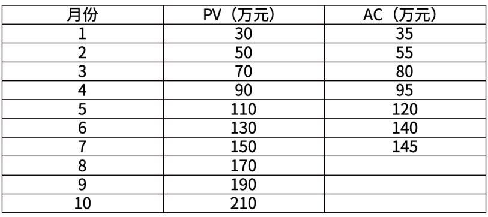
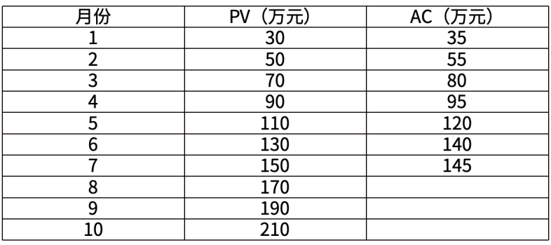
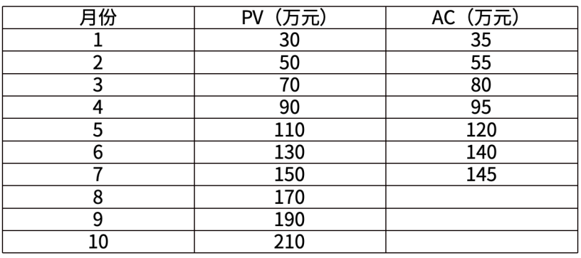
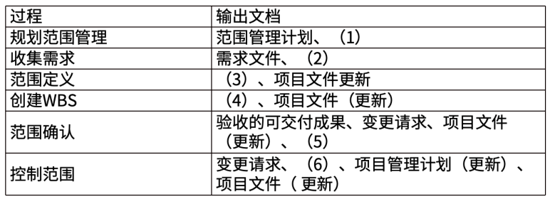
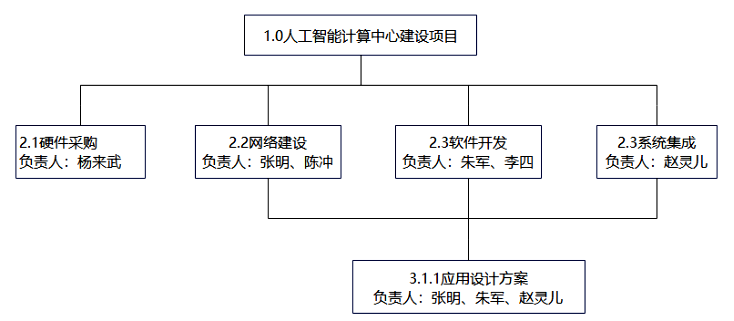

# 软考高项综合测试题-案例（6）

- 试卷 tid：`2421`
- 作答记录 tid：`7036293`
- 来源：https://yun.aura.cn/Test/alsTyper/lid/0/tid/7036293/typer/5/write/3.html

## 试题一

【说明】
某海关拟建设电子订单人工智能平台，采用光学字体识别技术（OCR），将多语种报关单、身份证件等文件转为电子文档，以提高报关效率。项目由小张任项目经理，小张初步分析项目需求后，与发起人共同制定了项目章程，章程内容包括：项目目的、项目目标（60天内提高报关效率）、项目描述、项目边界定义、项目退出标准，拟申请的财务资源、关键用户名单，项目审批要求，项目经理签名、发起人和批准人签名，项目章程获得批准后，小张组建了项目团队。电子订单人工智能平台的建设主要包括六个工作模块，内容和特点如下：（1）平台硬件交付：包括人工智能服务器、网络、高拍仪等的采购、搭建、测试等，需求明确、建设方法成熟、要求训练数据到位前交付。（2）数据采集和标注：要求数据小组一次性交付50万张报关单及身份证件图片及标注结果。（3）OCR模型调试：要求数据小组多次调试并交付模型，精度不断提高，直到实现关务部门认可的效果和性能。（4）OCR算法开发：创新程度高，团队没有同类项目开发经验，3天就需要更新一次，确保开发方向正确。（5）前端界面开发：需要展示界面风格，操作步骤多次向关务部门进行演示，尝试用各种选项澄清范围和需求，在最后完成可接受的全部功能。（6）平台操作测试：平台边研发边上线，完成一个功能模块就需要向相关人员提供一次操作或维护培训，在最后一次培训结束后才算完成全部工作。项目验收时，海关技术负责人、关务部门代表首次受邀参与项目，在验收评审会中指出了诸多问题，包括平台关键功能不完整、项目计划不合理、算法精度差、识别速度慢等，表示不认可交付成果。

【问题1】（6分）
结合项目案例，请指出本项目章程的内容存在哪些问题？

【问题2】（6分）
结合项目案例，请帮助小张为六个工作模块选择最适合的开发方法。A.预测型方法     B.迭代型方法     C.增量型方法     D.敏捷型方法（1）平台硬件交付（）；  （2）数据采集和标注（）；（3）OCR 模型调试（）；  （4）OCR 算法开发（）；（5）前端界面开发（）；  （6）平台操作测试（）。

【问题3】（8分）
（1）结合项目案例，请指出小张应让相关干系人参与哪些项目工作，以避免验收阶段出现的问题。（2）有效执行干系人绩效域可以实现哪些预期目标？

【问题4】（5分）
结合案例，判断下列说法的正误（填写在对应栏内，正确的填写“√”，错误的填写“x”）。（1）CCB应负责提出合理、可执行的变更方案。（ ）（2）CCB由主要干系人共同组成，包括用户单位的关务部门代表人员。（ ）（3）批准的变更请求不应导致项目管理计划的更新（ ）（4）CCB是项目的所有者权益代表。（ ）（5）CCB是作业机构，不是决策机构。（ ）

### 参考答案

【问题1】（6分）
本项目章程的内容存在的问题：（1）项目的目标定义不够清晰，应是可测量的目标；（2）应包含高层次的需求；（3）应包含主要可交付成果；（4）应包含总体里程碑进度计划；（5）应包含项目整体风险；（6）财务资源是批准的，而不是拟申请的；（7）应包括关键干系人名单，而不是关键用户名单；（8）项目经理的职权未明确定义。

【问题2】（6分）
（1）平台硬件交付（A）；  （2）数据采集和标注（A）；（3）OCR 模型调试（B）；  （4）OCR 算法开发（D）；（5）前端界面开发（B）；  （6）平台操作测试（C）。

【问题3】（8分）
1.为了避免在验收阶段出现的问题，小张应让相关干系人参与以下项目工作：①为项目团队定义需求和范围，并对其进行优先级排序；②参与并制定规划；③确定项目可交付物和项目成果的验收和质量标准：④客户、高层管理人员、项目管理办公室领导或项目集经理等干系人将重点关注项目及其可交付物绩效的测量。2.干系人绩效域实现的预期目标包括：①与干系人建立高效的工作关系；②干系人认同项目目标；③支持项目的干系人提高了满意度，并从中收益；④反对项目的干系人没有对项目产生负面影响。

【问题4】（5分）
（1）CCB应负责提出合理、可执行的变更方案。(X)解析：CCB不提出变更方案，变更请求者提交初步的变更方案。（2）CCB由主要干系人共同组成，包括用户单位的关务部门代表人员。（√）（3）批准的变更请求不应导致项目管理计划的更新（X）解析：批准的变更请求可能对项目或项目管理计划的相关领域产生影响，还可能导致修改正式受控的项目管理计划组件或项目文件。（4）CCB是项目的所有者权益代表。（√）（5）CCB是作业机构，不是决策机构。(X)解析：CCB是决策机构，不是作业机构。

---

## 试题二

【说明】
某项目计划工期为 10 个月，预算 210 万元，第 7 个月结束时，项目经理进行了绩效评估，发现实际完成了总计划进度的 70%。项目的实际数据如下表所示：

**题图：**

【问题1】（4分）
根据项目数据表，可以确定（  ） 月份的实际花费最低，仅为（  ）万元。

【问题2】（9分）
计算项目第7个月底时的 EV、CV、SV 值。

【问题3】（4分）
评估项目第7个月底时的绩效，并给出改进措施。

【问题4】（8分）
如果在第7个月结束时，找到了影响绩效的原因并纠正了项目偏差，请计算ETC 和 EAC。并预测此种情况下项目完成时间较原计划提前？落后？不变？

### 参考答案

【问题1】（4分）
7月份最低，仅为5万元。（当月的AC值减去上月的AC值，即为本月实际花费。）某项目计划工期为 10 个月，预算 210 万元，第 7 个月结束时，项目经理进行了绩效评估，发现实际完成了总计划进度的 70%。

【问题2】（9分）
项目第 7个月底时：PV=150(万元)EV=210*70%=147(万元)AC=145(万元)CV=EV-AC=147-145=2(万元)SV=EV-PV=147-150=-3(万元)某项目计划工期为 10 个月，预算 210 万元，第 7 个月结束时，项目经理进行了绩效评估，发现实际完成了总计划进度的 70%。

【问题3】（4分）
因为CV>0，SV<0，所以成本节约，进度滞后。可以采取以下措施：（1）赶工，投入更多的资源或增加工作时间，以缩短关键活动的工期。（2）快速跟进，并行施工，以缩短关键路径的长度。（3）使用高素质的资源或经验更丰富的人员。（4）减小活动范围或降低活动要求。（5）改进方法或技术，以提高生产效率。（6）加强质量管理，及时发现问题，减少返工，从而缩短工期。

【问题4】（8分）
BAC=210(万元)EV=147(万元)AC=145(万元)根据题目表述属于非典型偏差，所以ETC=BAC-EV=210-147=63万元EAC=AC+ETC=145+63=208(万元)。因当前项目进度滞后，纠偏后项目将按计划进行，因此项目完成时间会落后于计划完成时间。

---

## 试题三

【说明】
某市计划建设人工智能计算中心、作为新型生产力的重要抓手，向区域内进行智能化转型的企业提供人工智能算力。该建设项目需要进行设备采购、平台软件采购、网络建设、软件开发等工作，投资额较大。项目建设主管部门对申请报告批准后，建设单位对技术可行性、经济可行性、运行环境可行性进行了细致地研究和分析。但是，可行性研究报告未通过主管部门审批，原因是：缺少社会效益可行性分析。建设单位修改报告后再次提交。由于项目金额较大，主管部门聘请具有相关资质的A设计院进一步评估项目可行性，A 设计院评估了项目的可行性研究报告，项目关键建设条件和工程的协议文件。由于A设计院缺少熟悉人工智能领域的技术专家，设计院总工程师初步进行了技术可行性分析，认为其技术方案设计比较丰富，项目关键建设条件和工程协议文件比较全面，于是在可研报告上签署了同意，并将其发布为评估报告。项目立项后，建设单位项目经理老陈为明确项目边界，实施了如下项目范围管理过程，规定项目输出相应文档。项目经理老陈分解项目工作，形成完整的WBS如下图所示：

**题图：**

【问题1】（8分）
结合项目案例，请指出可行性研究中，社会效益可行性分析包含哪些方面的内容？

【问题2】（6分）
结合案例，依据项目评估工作程序，请指出A设计院评估过程存在的问题。

【问题3】（6分）
请补充项目范围管理各过程输出中缺失的文档。

【问题4】（5分）
请指出老陈编制的 WBS 不妥之处。

### 参考答案

【问题1】（8分）
社会效益可行性分析应包括：对组织内部：品牌效益、竞争力效益、技术创新效益、人员提升收益、管理提升效益。对社会发展：公共效益、文化效益、环境效益、社会责任感效益、其他收益。

【问题2】（6分）
A设计院评估过程存在的问题：（1）没有成立评估小组；（2）没有开展详细的调查研究；（3）评估的依据不足，仅仅只是评估了项目的可行性研究报告，缺少项目关键建设条件和工程的协议文件；（4）没有按照项目评估内容和要求，对项目进行技术经济分析和评估，只是进行了初步技术可行性分析；（5）没有组织编写、讨论和修改评估报告，只是在可研报告上签署了同意，并将其发布为评估报告；（6）没有召开专家论证会；（7）没有定稿评估报告。

【问题3】（6分）
（1）需求管理计划；（2）需求跟踪矩阵；（3）项目范围说明书；（4）范围基准；（5）工作绩效信息；（6）工作绩效信息。

【问题4】（5分）
老陈编制的 WBS 不妥之处有：（1）WBS 不符合项目的范围，WBS 的分解有遗漏，缺少软件平台采购这个工作；（2）WBS 底层应该支持计划和控制；（3）WBS 中的元素多人负责不妥，只能有一个人负责；（4）WBS 应控制在 4-6层；（5）一个工作单元只能从属于某个上层单元，应避免交叉从属；（6）WBS应包括项目管理工作；（7）WBS 的编制缺少干系人参与；（8）WBS 的编号不正确，从第2层开始，应该是1.1,1.2,1.3，第三层应为1.1.1、1.1.2等。

---
