# 软考高项综合测试题-案例（7）

- 试卷 tid：`2422`
- 作答记录 tid：`7036297`
- 来源：https://yun.aura.cn/Test/alsTyper/lid/0/tid/7036297/typer/5/write/3.html

## 试题一

【说明】
某科技公司承接一个创新型供应链金融项目，开发一套整合区块链技术的“端到端数字化解决方案”，项目经理开展了如下范围管理和风险管理相关活动。活动1：通过召开跨部门沟通会，识别出应收账款登记、核心供应商自动结算、跨境支付模块，供应商评级算法等13项核心需求；活动2：明确了项目一期必须交付的智能合约融资MVP（最小可行产品），其中含应收账款登记核心供应商自动结算功能，其他功能放入第二期；活动3：项目组通过访谈讨论，列出了项目面临的智能合约安全漏洞、数据合规争议和跨境支付模块技术难度高3个主要风险；活动4：开展了风险发生概率与影响程度分析；活动5：通过风险登记册标注了优先级；活动6：针对识别出的3个主要风险分别制定了代码审计、预留解决争议的储备金和购买跨境支付服务应对方案。

**题图：**

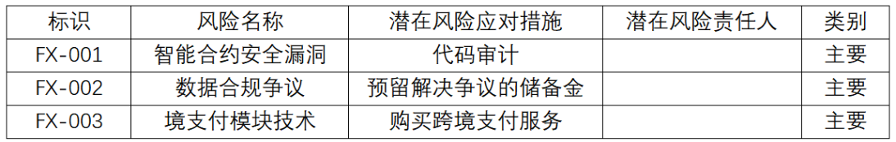

【问题4】（3分）
针对活动6制定的代码审计、预留解决争议的储备金和购买跨境支付服务的三个应对措施，依次分别属于哪种风险应对措施。

### 参考答案

【问题4】（3分）
减轻、接受、转移试题分析①风险减轻是指采取措施来降低威胁发生的概率和影响。提前采取减轻措施通常比威胁出现后尝试进行弥补更加有效。减轻措施包括采用较简单的流程、进行更多次测试和选用更可靠的卖方。还可能涉及原型开发，以降低从实验台模型放大到实际工艺或产品中的风险。代码审计可以降低安全漏洞的威胁，但并不能100%消除，故第一处填减轻更合适。②风险接受是指承认威胁的存在。此策略可用于低优先级威胁，也可用于无法以任何其他方式经济有效地应对的威胁。接受策略又分为主动或被动方式。最常见的主动接受策略是建立应急储备，包括预留时间、资金或资源以应对出现的威胁；被动接受策略则不会主动采取行动，而只是定期对威胁进行审查，确保其并未发生重大改变。③转移涉及将应对威胁的责任转移给第三方，让第三方管理风险并承担威胁发生的影响。采用转移策略通常需要向承担威胁的一方支付风险转移费用。风险转移可能需要通过一系列行动才得以实现，主要包括购买保险、使用履约保函、使用担保书和使用保证书等；也可以通过签订协议，把具体风险的归属和责任转移给第三方。

---

## 试题二

【说明】
某医疗大数据公司基于机器学习技术正在研发糖尿病风险预测系统，由10名开发人员组成的项目团队，需在六个月内完成全流程开发，并推进项目商业落地，项目活动关键信息如下表：在模型训练方面，项目需要依赖第三方供应商提供的健康数据集，其质量直接决定预测模型在早期识别糖尿病风险的有效性，在预算紧缩与开发周期限定的双重挑战下，供需双方展开策略博弈：A：供应商侧：提供S1（高价+高质量数据）或S2（低价+标准数据）两种方案；B：项目团队：需要选择T1（接受高价+联合风险担保）或T2（拒绝高价+自担延期风险）作为应对机制。

**题图：**

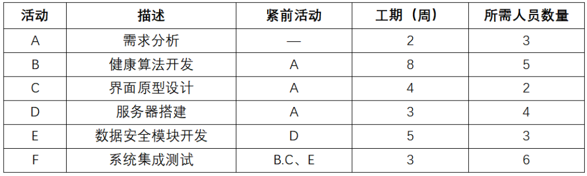
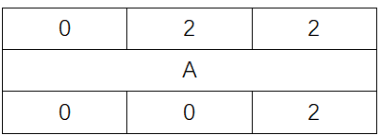
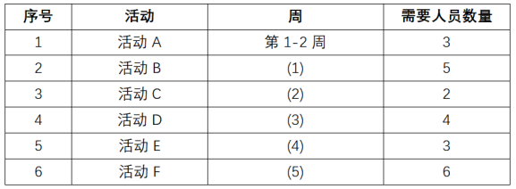
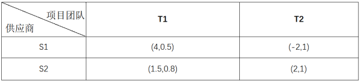
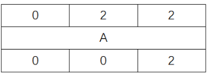
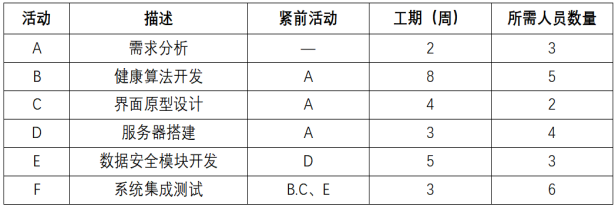
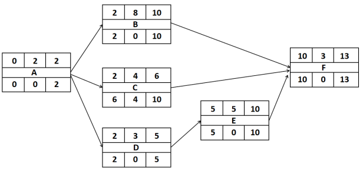
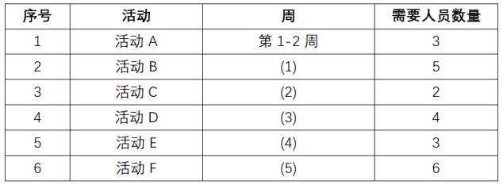
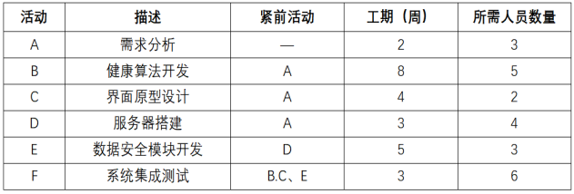
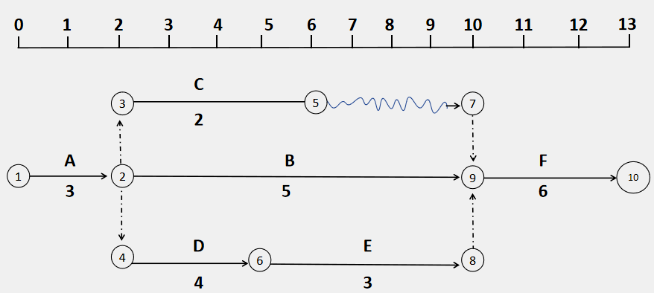
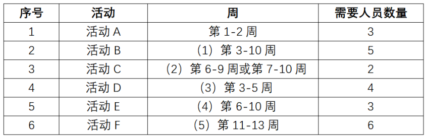
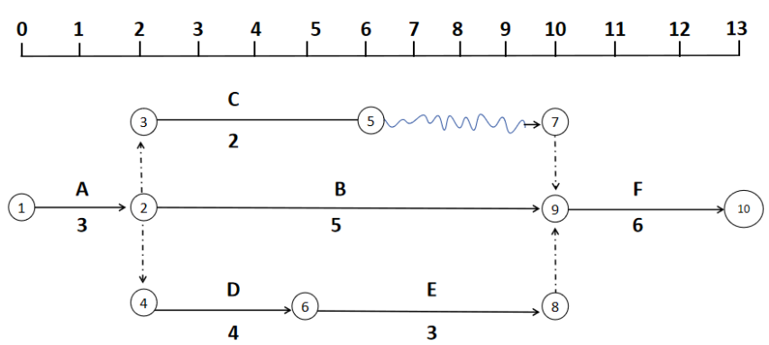
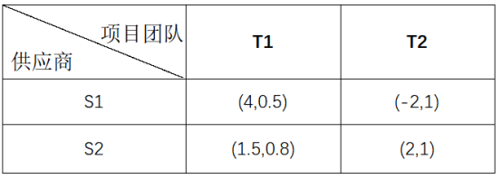

【问题1】（5分）
（2）计算项目关键路径及总工期。（3分）

### 参考答案

【问题1】（5分）
（1）C的最迟开始时间是第6周、总浮动时间是4周、最迟完成时间是第10周，活动F的最早开始时间是第10周、最早完成时间第13周。（2）关键路径有2条：A-B-F、A-D-E-F，工期是13周。试题分析:本题直接按提示要求画单代号图并将ES、EF、LS、LF和总时差的数据体现出来即可，本题并未要求画所有活动，完整的图如下：

---

## 试题三

【说明】
某公司计划开发一套智能物流系统，通过A1进行物流路径规划、库存管理和无人配送，以提高物流效率，降低运营成本，预计开发周期为12个月。项目团队中有两位来自非洲国家的成员，文化背景差异较大。项目经理小王安排了相关培训，让团队成员了解各自国家的工作习惯和沟通风格。项目启动阶段，小王组织人员制定项目管理计划，包括范围管理计划，成本管理计划，进度管理计划，质量管理计划，采购管理计划等。此外，为了评估激励水平，小王通过与团队成员的沟通和调研，综合考虑团队成员对项目成功的奖励期望（如额外休假等）和对项目成功的信心，分析得出团队成员对项目成功的目标效价平均评分为7.5分（满分10分），对项目成功的整体期望值是65%。项目执行阶段，质量经理强调全员参与质量管理，并定期组织质量改进会议，使项目团队能够及时发现并解决潜在问题，优化工作流程。开发人员每完成一个功能模块，会先进行单元测试。全部模块完成后，再进行集成测试。通过这些测试，开发团队可以确保交付的模块满足客户的功能需求，为最终验收做好准备。开发过程中，两位研发人员在某功能模块接口实现时出现分歧，都认为该接口功能应该由对方来实现。小王组织双方共同分析问题，寻找解决方案。在项目测试阶段，测试团队发现了一些重复出现的缺陷，小王组织团队进行根本原因分析，通过分析发现，这些缺陷的根源在于需求文档的不清晰和开发团队对需求理解的不一致。针对这一问题，项目组采取了改进措施，从而有效减少了类似缺陷的出现，另外测试时小王还发现某个数据处理功能可能不符合最新的数据隐私法规，要求研发人员对该功能进行改进。

**题图：**

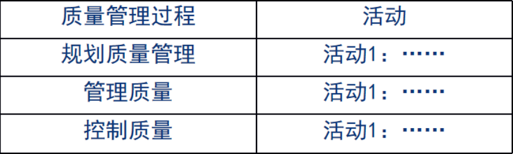
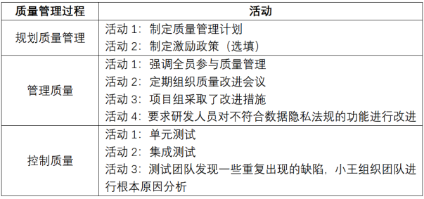

### 参考答案

---
