# 软考高项综合测试题-案例（8）

- 试卷 tid：`2423`
- 作答记录 tid：`7006328`
- 来源：https://yun.aura.cn/Test/alsTyper/lid/0/tid/7006328/typer/5/write/3.html

## 试题一

【说明】
A公司中标某大型医疗集团的智慧信息化建设项目，小张作为项目经理，负责该项目建设工作。在项目启动后的某次项目例会上，医疗集团领导希望A公司可以运用大模型AI等新技术，在一个月内实现运营数据的分析。小张认为，该部分功能相比总合同而言占比不大，又考虑在一个月内可以完成上线，且该领导对项目验收有话语权。小张认为，满足该领导需求，但介于目前公司缺乏大数据领域的技术开发人员，小张建议公司外包并推荐最近比较火的B公司签订合同后，B公司驻场工作两周后出现了问题：1.B产品稳定性差，数据丢失和获取重复的问题解决，需要依赖驻场开发工程师，工作效率低下。2.B公司未做过有关医疗项目，知识薄弱对需求理解不深入，未在预定时间内梳理出需求跟踪矩阵。3.B公司融资受阻，工资延发，驻场工作纪律差，项目经理无法推进计划离职，上线延迟风险高。小张责令B公司的整改措施：1.B产品重新执行测试，已发现问题测试通过后再重新向客户提交。2.B公司的医疗专家与用户核实需求，描述完成需求跟踪矩阵。3.签订补充协议，针对当前问题给出赔偿方案。

【问题1】（6分）
结合项目案例，从范围管理与风险管理角度帮助小张给出改进措施。

【问题2】（6分）
从风险管理角度写出，小张三个措施分别属于哪种风险应对措施？

【问题3】（7分）
需求跟踪矩阵的作用是什么？

【问题4】（6分）
合同争议的解决方式依次为（1）、（2）（3）（4）。

### 参考答案

【问题1】（6分）
范围管理改进措施：（1）建立正式的范围变更控制流程，确保任何新需求都经过评估和批准（2）在接受新需求前进行详细的可行性分析，包括资源需求、技术能力评估（3）制定详细的工作分解结构（WBS），明确所有工作包的界限和责任（4）明确项目范围说明书，避免范围蔓延（5）做好范围确认工作（6）做好收集需求，记录并管理干系人的需要和需求风险管理改进措施：（1）实施供应商评估制度，全面考察技术能力、项目经验和财务状况（2）建立风险登记册，提前识别并量化外包风险（3）制定应急预案，为关键风险准备备选方案（4）加强合同管理，明确违约责任和质量验收标准（5）实施分阶段交付，降低一次性失败风险。（6）识别单个项目风险，以及整体项目风险的来源，并记录风险特征

【问题2】（6分）
B产品重新测试，测试通过后再提交风险应对类型：减轻（通过测试降低产品缺陷的可能性）。B公司医疗专家与用户核实需求，完成需求跟踪矩阵风险应对类型：减轻（引入专家资源降低需求理解错误的风险）。签订补充协议，给出赔偿方案风险应对类型：转移（通过合同条款将部分风险转移给B公司，违约责任赔偿）。

【问题3】（7分）
需求跟踪矩阵的作用：（1）需求跟踪矩阵提供了在整个项目生命周期中跟踪需求的一种方法。（2）有助于确保需求文件中被批准的每项需求在项目结束的时候都能实现并交付。（3）需求跟踪矩阵还为管理产品范围变更提供了框架。

【问题4】（6分）
（1）协商、（2）调解、（3）仲裁、（4）诉讼

---

## 试题二

【说明】
某项目计划工期为 10 个月，预算 210 万元，第 7 个月结束时，项目经理进行了绩效评估，发现实际完成了总计划进度的 70%。项目的实际数据如下表（1）所示，各活动单日费用需 0.5万元，这6 个活动由 6个小组完成，每个小组只能承担一个活动。由于活动性质及每个小组的技术水平不同，他们完成各项活动所需的总费用及时间也不同。各组完成各项活动的总费用 （单位：万元）。如表（2）所示。 
                 表（1）
                       表（2）

**题图：**

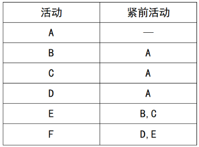
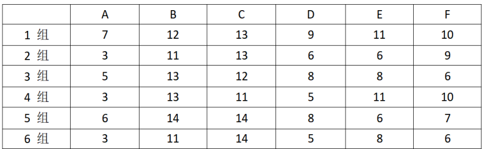
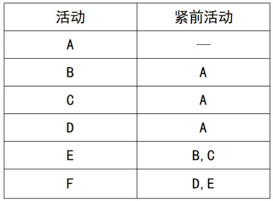
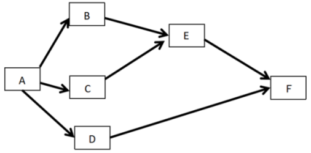

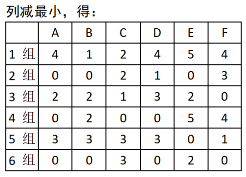
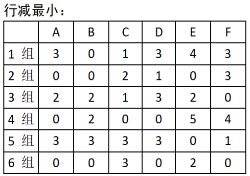
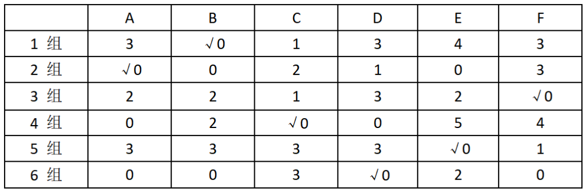
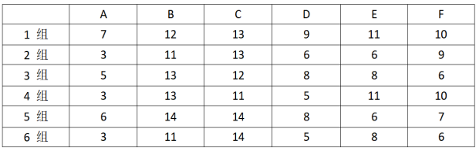
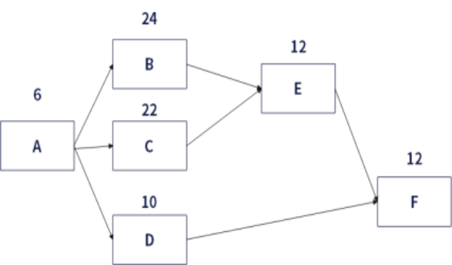

【问题1】（4分）
根据题意，请画出项目的单代号网络图

【问题2】（14分）
为了确保项目能够以最小总费用完成，需要合理安排负责各活动的小组。请使用运筹学中的指派问题方法，确定总费用最小的小组指派方案，并计算最小费用。

【问题3】（7分）
根据最小总费用指派方案，计算各活动完成时间，给出关键路径，并计算项目总完成时间。

### 参考答案

【问题2】（14分）
解题思路：匈牙利算法解题步骤:步骤一：每列选最小值，每个值都减去它步骤二：每行选最小值，每个值都减去它步骤三：排列组合选最优然后找唯一0的，先找到1组，3组，5组，都是唯一0，得1组做 B，3组做F，5组做E；然后再2组做A （去掉 B列和E列后，2组唯一0了），然后6组做D （前面去掉ABF 列了），最后4组做C。最后各组做的活动，见下表√部分：所以最后得最小费用： 3+12+11+5+6+6=43万元

【问题3】（7分）
A=3万/0.5万/天=6天B=12/0.5=24天C=11/0.5=22天D=5/0.5=10天E=6/0.5=12天F=6/0.5=12天关键路径：ABEF=54天。

---

## 试题三

【说明】
公司A承接了一个大型信息系统研发项目，项目涉及公司内部研发、测试、运维、市场等多个部门的协同。项目团队采用敏捷开发模式进行软件研发，项目经理小李负责该项目的全面管理。在项目初期迭代测试过程中，发现部分功能模块的实际运行效果与设计预期偏差显著。经调查发现部分开发人员对新技术框架理解不足，在编码过程中也未遵循公司定制的详细编码规范，导致代码可读性与可维护性差。此外，在代码审查环节，审查流程没有明确的量化标准，审查人员仅凭经验简单浏览代码，且审查时间被其他紧急任务压缩，未能有效识别出潜在的代码漏洞与性能瓶颈问题。随着项目进展，客户需求逐渐清晰，需求变更逐渐增多，但部分变更请求直接与部分项目成员口头沟通，导致需求变更信息在传递过程中出现了偏差与遗漏，项目团队成员对变更内容理解不一致，造成部分已完成的工作需要返工。在项目团队内部，由于跨部门协作流程不完善，不同部门成员之间缺乏有效的信息共享机制。有时研发部门完成的功能模块更新未能及时通知测试部门，导致测试计划延误。在资源管理方面，项目团队中的核心技术人员大多身兼数职，不仅参与本项目，还承担着公司其他重要项目的技术支持工作。由于任务分配不合理，导致在本项目中的关键技术节点上，人力投入不足。

**题图：**

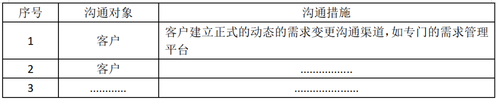
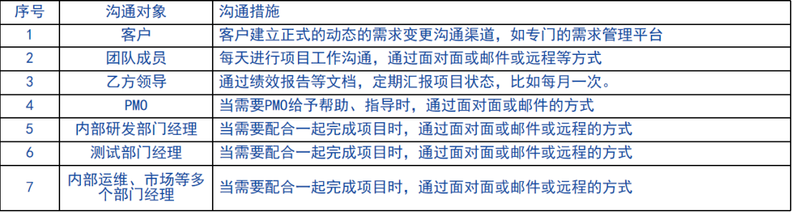

【问题1】（10分）
针对质量管理中出现的问题，详细阐述项目经理小李应采取的改进措施。

【问题2】（6分）
基于沟通管理中出现的问题：（1）请帮小李确认需要沟通的对象有哪些？（2）针对（1）给出的沟通对象，请参考表格中的示例，针对不同沟通对象，补充完成相应的沟通措施（重点写出沟通方式及频率两方面）。

【问题3】（3分）
项目所需资源可能来自项目执行组织的内部或外部。内部资源由（1）或（2）负责分配，外部资源则通过（3）过程获得。

【问题4】（6分）
（1）在质量管理中，质量保证主要关注产品是否符合质量标准，而质量控制主要关注过程是否稳定。（  ）（2）在资源管理中，资源日历规定了项目期间确定的团队和实物资源何时可用、可用多久。（  ）（3）进度压缩技术是在同时考虑资源可用性和项目时间的情况下，对活动和活动所需资源进行进度规划。（4）使用人工检查代码的方法来检查代码的逻辑问题，也属于黑盒测试的范畴。（  ）（5）在项目管理中，沟通计划是确保项目团队与客户之间信息传递的关键。（  ）（6）在项目管理中，与客户的沟通应主要通过正式的渠道进行，非正式沟通可能会导致信息传递不准确。

### 参考答案

【问题1】（10分）
质量管理的改进措施如下：1. 持续改进：采用“计划—实施—检查—行动（PDCA）”循环，也可运用全面质量管理（TQM）、六西格玛和精益六西格玛等举措。2. 改进企业质量管理体系：修改质量体系文件，让项目经理和技术人员参与，使其符合项目实际管理需要。要求项目组严格执行质量体系文件，设质量管理人员检查和监督。项目实施中发现不适合处提出改进建议，完善质量体系。3、做好质量管理计划，识别项目及其可交付成果的质量要求、标准。4、做好质量管理，把组织的质量政策用于项目，并将质量管理计划转化为可执行的质量活动。5、做好控制质量，实时监督和记录质量管理活动的执行结果，确保项目输出完整、正确，且满足客户期望。

【问题3】（3分）
（1）职能经理（2）资源经理（3）采购试题解析获取资源是获取项目所需的团队成员、设施、设备、材料、用品和其他资源的过程。本过程的主要作用：①概述和指导资源的选择；②将选择的资源分配给相应的活动。本过程应根据需要在整个项目期间定期开展。项目所需资源可能来自项目执行组织的内部或外部。内部资源由职能经理或资源经理负责获取（分配），外部资源则通过采购过程获得。

【问题4】（6分）
（1）在质量管理中，质量保证主要关注产品是否符合质量标准，而质量控制主要关注过程是否稳定。（ × ）（2）在资源管理中，资源日历规定了项目期间确定的团队和实物资源何时可用、可用多久。（ √ ）（3）进度压缩技术是在同时考虑资源可用性和项目时间的情况下，对活动和活动所需资源进行进度规划。（× ）（4）使用人工检查代码的方法来检查代码的逻辑问题，也属于黑盒测试的范畴。（ ×  ）（5）在项目管理中，沟通计划是确保项目团队与客户之间信息传递的关键。（ √ ）（6）在项目管理中，与客户的沟通应主要通过正式的渠道进行，非正式沟通可能会导致信息传递不准确。（ ×  ）试题解析（1）在项目管理中，质量保证着眼于项目使用的过程，旨在高效地执行项目过程，包括遵守和满足标准，向干系人保证最终产品可以满足他们的需求、期望和要求。控制质量是为了评估绩效，确保项目输出完整、正确且满足客户期望，而监督和记录质量管理活动执行结果的过程（3）资源优化技术是在同时考虑资源可用性和项目时间的情况下，对活动和活动所需资源进行的进度规划。（4）使用人工检查代码的方法来检查代码的逻辑问题，属于白盒测试的范畴。（6）非正式沟通可能会导致信息传递不准确太绝对，项目管理中强调沟通方式的多样性，此处表述稍显绝对。

---
